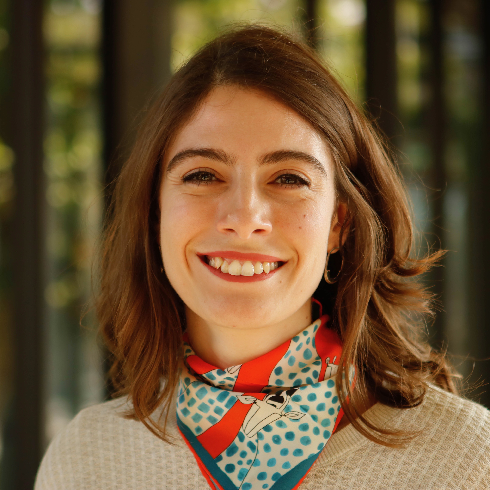

 

I am an Assistant Professor in the [Department of Psychology](https://www.ozyegin.edu.tr/en/department-psychology) at Özyeğin University and the director of the [Language Cognition and Development Lab](http://www.labs.ozyegin.edu.tr/gelisim/).

I obtained my Ph.D. in Cognitive Psychology at University of Delaware and completed my postdoctoral work at Radboud University and Max Planck Institute for Psycholinguistics. 

I study the human language system and its relation to cognition using developmental and cross-linguistic approaches. Throughout my work, I adopt a multimodal view of language by drawing on evidence from both auditory (speech) and visual (gesture, sign) modalities. My work is informed by theoretical and methodological approaches from different disciplines under cognitive science, including psychology and linguistics. The goal of my research is to establish which aspects of human cognition are universally shared and which aspects might be shaped by linguistic diversity. 
