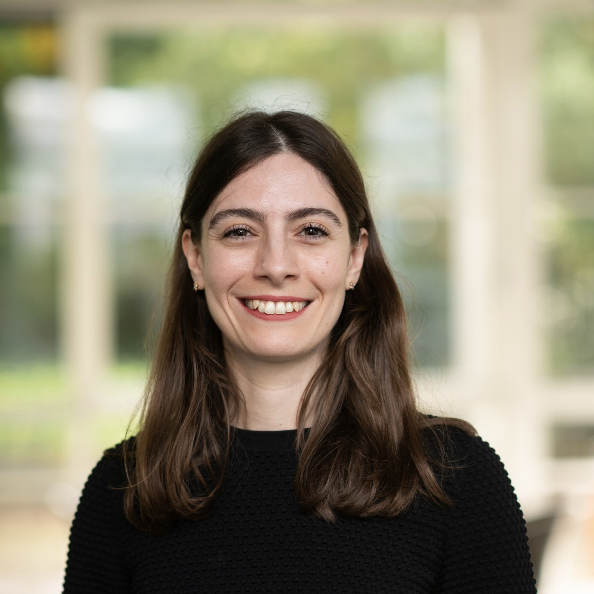

I am a Cognitive Scientist studying the human language system and its relation to other aspects of cognition. Throughout my work, I adopt a multimodal view of the language system by drawing on evidence from both auditory (speech) and visual (gesture, sign) modalities. My goal is to establish which aspects of human cognition are universally shared, which aspects might be shaped by cross-linguistic and cross-modal diversity, and how the relation between language and cognition changes throughout development.

I obtained my Ph.D. in Cognitive Psychology in 2016 at University of  where I worked with Anna Papafragou. Then, I received postdoctoral training at Radboud University and Max Planck Institute for Psycholinguistics. Between 2018 and 2024, I was first Assistant, then Associate Professor of Psychology at Özyeğin University in Istanbul where I directed the [Language Cognition and Development Lab](http://www.labs.ozyegin.edu.tr/gelisim/). Since September 2024, I am a staff scientist in the [Multimodal Language Department](https://www.mpi.nl/department/multimodal-language-department/23) at Max Planck Institute for Psycholinguistics. 
