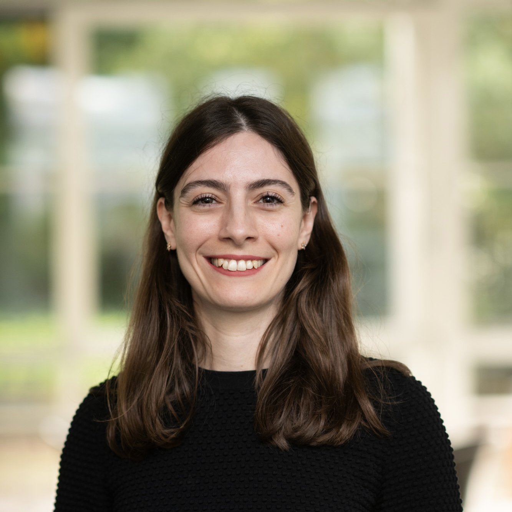

I am a Cognitive Scientist studying the human language system and its relation to other aspects of cognition. I have a particular focus on relational concepts&mdash;where things are located in *space* or who is doing what to whom, when and where in *events*. Relational concepts are a central aspect of cognition, yet their expression in language is characterized by considerable variability. I am interested in two kinds of variability: cross-linguistic differences in formal features devices in spoken languages (e.g., grammatically required versus optional distinctions, partitioning of the semantic space) and the affordances of different expressive modalities&mdash;such as, speech or gesture&mdash;that give rise to distinct mapping requirements between language and cognition. I study how relational concepts are mapped onto the multimodal language system in different languages, how children acquire these mappings, how they are processed during real-time language production and comprehension, and whether acquiring them reshapes conceptual representations across development. To address these issues, I take an interdisciplinary and multimethod approach combining perspectives in psychology, linguistics, and cognitive science. My work leverages cross-linguistic and cross-modal variation to identify which aspects of cognition are universally shared, which are shaped by multimodal language use and learning, and how language and cognition interact across development.

I obtained my Ph.D. in Cognitive Psychology in 2016 at University of  where I worked with Anna Papafragou. Then, I received postdoctoral training at Radboud University and Max Planck Institute for Psycholinguistics. Between 2018 and 2024, I was first Assistant, then Associate Professor of Psychology at Özyeğin University in Istanbul where I directed the [Language Cognition and Development Lab](
https://labs.ozyegin.edu.tr/gelisim/). Since September 2024, I am a staff scientist in the [Multimodal Language Department](https://www.mpi.nl/department/multimodal-language-department/23) at Max Planck Institute for Psycholinguistics. 
